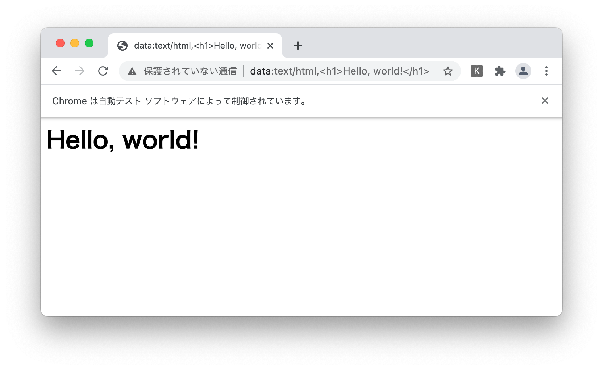

Enabling Data URL in Katalon Studio
========

- date APRIL,2021
- author kazurayam

This project develops and provides a Plugin named `katalon-studio-data-url` for [Katalon Studio](https://www.katalon.com/katalon-studio/).

You can download this project's zip file at the [Releases](https://github.com/kazurayam/katalon-studio-data-url/releases/) page, unzip it, open it with Katalon Studio on your PC.

This project was developed using Katalon Studio version 7.9.1. But it is not KS-version-dependent, should work on any versions above 7.0.

# Problem to solve

In the Katalon Forum, there are a few posts that ask Katalon Studio to support Data URL.

- https://forum.katalon.com/t/urls-supplied-to-katalon-apis-must-support-data-uris/12203/
- https://forum.katalon.com/t/katalon-does-not-support-data-urls-rfc2397/23672/

I want to write a Test Case script like this:

```
import com.kms.katalon.core.webui.keyword.WebUiBuiltInKeywords as WebUI

WebUI.openBrowser("data:text/html,<h1>Hello, world!</h1>")
```

Here the code fragment "`data:text/html,<h1>Hello, world!</h1>`" is called [Data URLs](https://developer.mozilla.org/en-US/docs/Web/HTTP/Basics_of_HTTP/Data_URIs) as described in [RFC2397](https://tools.ietf.org/html/rfc2397). 

I expect to see a view in browser like this:



But when I executed this script in Katalon Studio v7.9.1, I saw the following result which is disappointing:


Katalon Studio's keywords `WebUI.openBrowser(String url)` and `WebUI.navigateToUrl(String url)` do not support Data URLs.

# Solution

I studied the source code and found a way to enable Katalon Studio to support Data URL. I have developed a plugin module.

# Description

## How to install the plugin

- visit [Releases](https://github.com/kazurayam/katalon-studio-data-url/releases/) page, download the latest version of `katalon-studio-data-url-x.x.x.jar`.
- create your Katalon Studio project, which has a `Plugins` directory under the project directory.
- locate the downloaded jar file in the `Plugins` directory.
- close/reopen your project to let Katalon Studio acknowledge the jar.

You are done.

## How to write your Test Case

In a Test Case script in the Script mode, add one line of `import` statement and one line of `dataurl.enable()` before calling `WebUI.openBrowser(String)` and `WebUI.navigateToUrl(String)`. That's all. The WebUI keywords will be enabled for `data:` URLs.

Let me show you some examples.

### WebUI.openBrowser() ito open 'data:text/html'

[`Test Cases/research/3_webui_enabledTo_navigateTo_data_html`](Scripts/research/3_webui_enabledTo_navigateTo_data_html/Script1619174550245.groovy)
```
import com.kms.katalon.core.webui.keyword.WebUiBuiltInKeywords as WebUI

// enable WebUI keywords to accept 'data:' URL
import com.kazurayam.ks.util.DataURLEnabler as dataurl
dataurl.enable()

WebUI.openBrowser("data:text/html,<h1>Hello, world!</h1>")

WebUI.delay(5)
WebUI.closeBrowser()
```

### WebUI.navigateToUrl() to open 'data:image/png'

[`Test Cases/research/4_webui_enabledTo_navigateTo_data_png`](Scripts/research/4_webui_enabledTo_navigateTo_data_png/Script1619174581290.groovy)
```
import com.kazurayam.ks.util.DataURLEnabler as dataurl
import com.kms.katalon.core.webui.keyword.WebUiBuiltInKeywords as WebUI

// create a "data:image/png;base64,xxxxxxxxxxxxxxx" for demo
String pngdataurl = dataurl.demoImage()
//println pngdataurl

// enable WebUI keywords to accept 'data:' URL
dataurl.enable()

WebUI.openBrowser('')
WebUI.navigateToUrl(pngdataurl)

WebUI.delay(5)
WebUI.closeBrowser()

```

When I ran this script, I got the follwing display result:


## Research: how Katalon Studio misinterprets a `data:` URL to be a `file:` URL

You can read the source of Katalon Studio Keyword:

- [`WebUI.navigateToUrl`](https://github.com/katalon-studio/katalon-studio-testing-framework/blob/master/Include/scripts/groovy/com/kms/katalon/core/webui/keyword/builtin/NavigateToUrlKeyword.groovy)

I found an interesting portion in it:

```
    public void navigateToUrl(String rawUrl, FailureHandling flowControl) throws StepFailedException {
        WebUIKeywordMain.runKeyword({
            ...
            URL url = PathUtil.getUrl(rawUrl, "http")
            ...
            WebDriver webDriver = DriverFactory.getWebDriver()
            webDriver.navigate().to(url.toString())
            ...
```

My experiment revealed that `PathUtil.getUrl("data:text/html,<h1>Hello, world!</h1>", ...)` returned an instance of `java.net.URL` with String value of `file:///Users/username/projectdir/data:text/html,%3Ch1%3EHello,%20world!%3C/h1%3E`.

I am sure that `com.kms.katalon.core.util.internal.PathUtil` is misinterpreting it. So how the source of `PathUtil.getUrl(String url, ...)` looks like?

- [`PathUtil`](https://github.com/katalon-studio/katalon-studio-testing-framework/blob/master/Include/scripts/groovy/com/kms/katalon/core/util/internal/PathUtil.java)

It is just constructing an instance of `java.net.URL` class:

```
    public static URL getUrl(String rawUrl, String defaultProtocol) throws MalformedURLException, URISyntaxException {
        URL url = null;
        try {
            url = new URL(rawUrl);
        } catch (MalformedURLException e) {
            ...
```

I consulted to my Guru called Google.

*Me*: Does the default implementation of [`java.net.URL`](https://docs.oracle.com/javase/7/docs/api/java/net/URL.html#URL) support Data URL? Can I instanciate it with `new URL("data:text/html,Hello world!")`?

*Guru*: No, it doesn't. As the javadoc clearly states, the default implementation supports only http, https, ftp, file, and jar.

*Me*: Is it possible to let `java.net.URL` instanciated with with `data:` URL somehow?

*Guru*: Yes, it is possible. The [javadoc of the constructor of `java.net.URL`](https://docs.oracle.com/javase/7/docs/api/java/net/URL.html#URL(java.lang.String,%20java.lang.String,%20int,%20java.lang.String)) clearly describes how to.

## How this plugin is implemented

The plugin is implemented with just 2 `.groovy` files.

- [`com.kazurayam.ks.util.DataURLEnabler`](Keywords/com/kazurayam/ks/util/DataURLEnabler.groovy)
- [`com.kazurayam.net.data.Handler`](Keywords/com/kazurayam/net/data/Handler.groovy)

Please read the source to find out how it is implemented.
